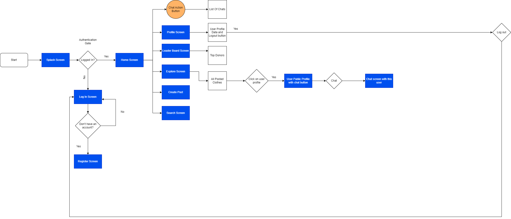

# Wearify

## Simplified version of the application flow


## Run
To run your Flutter code from this GitHub repo, you needs to follow these steps:

### Install the required software:
a. Install Git, if not already installed: https://git-scm.com/downloads
b. Install Flutter SDK: https://flutter.dev/docs/get-started/install
c. Install an IDE with Flutter support, such as Android Studio or Visual Studio Code, and the required plugins.

### Clone the repository using Git:

``` bash
git clone https://github.com/Hassan-Al-Achek/Wearify.git
```

### Open the project in the IDE (Android Studio or Visual Studio Code).

If using an IDE with Flutter support, the required packages should be automatically fetched. If not, or if there are any issues, you can manually fetch the packages by running the following command in the terminal:

```bash
flutter pub get
```

### Connect a physical device or start an emulator/simulator.

### Run the app using the IDE's run button, or by running the following command in the terminal:

```bash
flutter run
```
